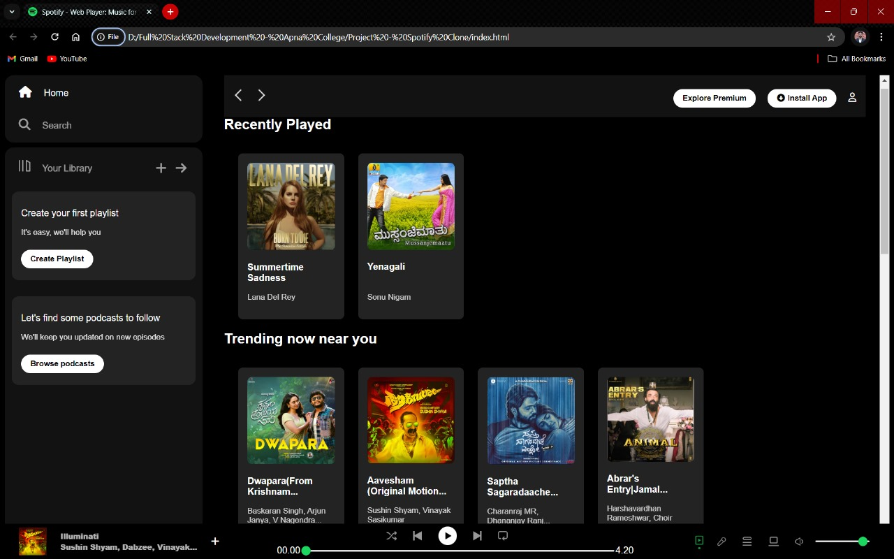

# Spotify Web Player Clone

This project is a clone of the Spotify Web Player, built using HTML, CSS, and Font Awesome for icons. It replicates the basic structure and styling of Spotify's web player, providing a familiar interface for music enthusiasts.

## Features

- **Home and Search Navigation:** Easy navigation to home and search pages with stylish icons.
- **Your Library:** A section to manage your playlists and follow podcasts.
- **Recently Played:** Displays your recently played tracks.
- **Trending Now:** Showcases trending songs in your area.
- **Favorite Artists:** A curated list of your favorite artists.
- **Most Played:** Displays your most played tracks.
- **Featured Charts:** Highlights top songs and playlists.
- **Music Player:** A functional music player with playback controls and volume adjustments.

## Demo

## Responsiveness

This project is designed to be fully responsive, ensuring a seamless experience across various devices:

- **Desktop:** The layout utilizes flexbox for a clean and organized structure, adapting to large screens efficiently.
- **Tablet and Mobile:** The interface adjusts to smaller screens by hiding non-essential elements and optimizing the display of content. Media queries are used to modify the layout, font sizes, and visibility of certain icons for improved usability on tablets and mobile devices.

## Technologies Used

- **HTML5:** For the basic structure of the web pages.
- **CSS3:** For styling the components and layout.
- **Font Awesome:** For the icons used throughout the project.
- **Google Fonts:** For custom fonts.

## Setup and Usage

1. Clone the repository to your local machine.
2. Open the `index.html` file in your preferred web browser.
   
## File Structure

- `index.html`: The main HTML file containing the structure of the page.
- `style.css`: The CSS file containing all the styles and animations.
- `Project-Demo.jpg`: The preview of the page.
- `README.md`: This file.

## Contributing

Contributions are welcome! Please open an issue or submit a pull request for any changes or improvements.

## Acknowledgments

- [FontAwesome](https://fontawesome.com/)
- [Google Fonts](https://fonts.google.com/)
- [Apna College](https://www.apnacollege.in/home-post-login)

## Contact
- **Name: Ashith A V**
- **Email: ashithavgowda@gmail.com**
- **LinkedIn: https://www.linkedin.com/in/ashith-a-v-a3a0b1299**

For any questions or suggestions, feel free to reach out.

---

Feel free to customize this `README.md` as per your needs and add more sections if necessary.
